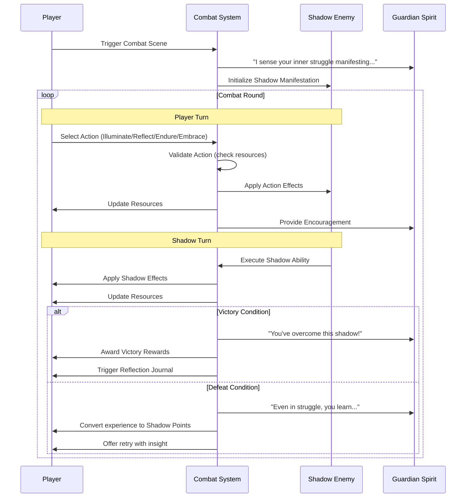

# Light & Shadow Combat System Documentation
## Luminari's Quest Therapeutic RPG Enhancement

### Table of Contents
1. [Concept Overview](#concept-overview)
2. [Core Mechanics](#core-mechanics)
3. [Shadow Manifestation Types](#shadow-manifestation-types)
4. [Combat Flow](#combat-flow)
5. [Therapeutic Benefits](#therapeutic-benefits)
6. [Implementation Architecture](#implementation-architecture)
7. [Integration with Existing Systems](#integration-with-existing-systems)
8. [Development Phases](#development-phases)

---

## Concept Overview

The Light & Shadow combat system transforms traditional RPG combat into a therapeutic metaphor for emotional regulation and resilience building. Players battle manifestations of their inner struggles using "Light Points" (earned through positive choices) and "Shadow Points" (representing challenges to overcome).

### Key Design Principles:
- Combat represents internal emotional struggles, not external violence
- Every defeat teaches growth rather than punishing failure
- Tactical choices mirror real-world coping strategies
- Resource management teaches emotional regulation skills

## Core Mechanics

### Dual Resource System

```typescript
interface LightShadowResources {
  lp: number;  // Light Points - Positive emotional resources
  sp: number;  // Shadow Points - Challenges that can become growth
}
```

#### Light Points (LP)
- **Earned from:**
  - Successful scene outcomes: +2-5 LP
  - Positive journal reflections: +1-3 LP
  - Guardian trust milestones: +5 LP
- **Used for:**
  - Illuminate attacks (2-4 LP)
  - Healing actions (3 LP)
  - Special abilities (varies)

#### Shadow Points (SP)
- **Accumulated from:**
  - Failed scene attempts: +1-3 SP
  - Unprocessed emotions: +1 SP per scene
  - Shadow enemy attacks: +1-2 SP
- **Transformed through:**
  - Reflect action: Convert SP to LP
  - Shadow Embrace: High-risk, high-reward moves

### Combat Actions

```typescript
export type CombatAction = 'ILLUMINATE' | 'REFLECT' | 'ENDURE' | 'EMBRACE';
```

#### 1. **Illuminate** (Offensive)
- **Cost:** 2 LP base (scales with trust)
- **Effect:** `3 + floor(guardianTrust / 4)` damage
- **Message:** "You shine light on your [fear/doubt/anger], seeing it clearly"
- **Therapeutic Insight:** Awareness and understanding reduce emotional pain

#### 2. **Reflect** (Transformative)
- **Cost:** 1-2 SP converts to 1 LP
- **Effect:** Heals 1 LP if current LP < 50% max
- **Message:** "You find wisdom in your struggle with [specific emotion]"
- **Therapeutic Insight:** Reframing difficulties as growth opportunities

#### 3. **Endure** (Defensive)
- **Cost:** None
- **Effect:** 50% damage reduction, generates 1 LP after 2 consecutive uses
- **Message:** "You weather the storm, finding strength in persistence"
- **Therapeutic Insight:** Sometimes the best action is patient endurance

#### 4. **Shadow Embrace** (Risk/Reward)
- **Requirement:** 5+ SP
- **Cost:** All SP
- **Effect:** `sp × 3` damage, self-damage `ceil(sp/2)` (reduced at high trust)
- **Message:** "You acknowledge your darkness as part of your strength"
- **Therapeutic Insight:** Integration of shadow self leads to wholeness

### Combat Mathematics

```typescript
// Damage calculations
const illuminateDamage = (trust: number) => 3 + Math.floor(trust / 4);
const embraceDamage = (sp: number) => sp * 3;
const embraceSelfDamage = (sp: number, trust: number) => 
  trust >= 60 ? Math.ceil(sp / 3) : Math.ceil(sp / 2);

// Enemy HP scaling
const enemyHP = (basehp: number, sceneDifficulty: number) => 
  basehp + (sceneDifficulty * 2);

// Enemy damage
const enemyDamage = (sceneDifficulty: number) => 
  2 + Math.floor(sceneDifficulty / 3);
```

## Shadow Manifestation Types

### Type Definitions

```typescript
export interface ShadowManifestation {
  id: string;
  name: string;
  type: 'doubt' | 'isolation' | 'overwhelm' | 'past-pain';
  description: string;
  currentHP: number;
  maxHP: number;
  abilities: ShadowAbility[];
  therapeuticInsight: string;
  victoryReward: {
    lpBonus: number;
    growthMessage: string;
    permanentBenefit: string;
  };
}

export interface ShadowAbility {
  id: string;
  name: string;
  cooldown: number;
  currentCooldown: number;
  effect: (state: CombatState) => void;
  description: string;
}
```

### Shadow Manifestations Data

```typescript
export const shadowManifestations = {
  whisperOfDoubt: {
    id: 'whisper-of-doubt',
    name: 'The Whisper of Doubt',
    type: 'doubt',
    description: 'A shadowy figure that echoes your deepest uncertainties',
    maxHP: 15,
    abilities: [
      {
        id: 'self-questioning',
        name: 'Self-Questioning',
        cooldown: 3,
        effect: (state) => {
          // Forces player to lose 1 LP per turn
          state.resources.lp = Math.max(0, state.resources.lp - 1);
        },
        description: 'Drains confidence steadily'
      },
      {
        id: 'magnification',
        name: 'Magnification',
        cooldown: 5,
        effect: (state) => {
          // Doubles damage from negative thoughts
          state.damageMultiplier = 2;
        },
        description: 'Makes small worries feel overwhelming'
      }
    ],
    therapeuticInsight: 'Doubt questioned becomes wisdom earned. Your inner critic can become your inner guide when balanced with self-compassion.',
    victoryReward: {
      lpBonus: 5,
      growthMessage: 'You\'ve learned to question your doubts as much as they question you.',
      permanentBenefit: '+1 LP generation from journal entries'
    }
  },

  shadeOfIsolation: {
    id: 'shade-of-isolation',
    name: 'The Shade of Isolation',
    type: 'isolation',
    description: 'A cold emptiness that separates you from warmth and connection',
    maxHP: 22,
    abilities: [
      {
        id: 'disconnection',
        name: 'Disconnection',
        cooldown: 4,
        effect: (state) => {
          // Prevents healing actions for 2 turns
          state.healingBlocked = 2;
        },
        description: 'Cuts you off from sources of comfort'
      },
      {
        id: 'echo-chamber',
        name: 'Echo Chamber',
        cooldown: 3,
        effect: (state) => {
          // Reflects negative thoughts back as damage
          const spDamage = Math.ceil(state.resources.sp / 2);
          state.resources.lp = Math.max(0, state.resources.lp - spDamage);
        },
        description: 'Your own shadows turn against you'
      }
    ],
    therapeuticInsight: 'Connection begins with connecting to yourself. You\'ve learned that solitude can be chosen strength, not imposed weakness.',
    victoryReward: {
      lpBonus: 7,
      growthMessage: 'In facing isolation, you\'ve found your own company can be enough.',
      permanentBenefit: 'Endure action now generates 2 LP instead of 1'
    }
  },

  stormOfOverwhelm: {
    id: 'storm-of-overwhelm',
    name: 'The Storm of Overwhelm',
    type: 'overwhelm',
    description: 'A chaotic maelstrom of too many thoughts and feelings at once',
    maxHP: 30,
    abilities: [
      {
        id: 'chaos-flood',
        name: 'Chaos Flood',
        cooldown: 2,
        effect: (state) => {
          // Generates 2-3 SP per turn
          state.resources.sp += Math.floor(Math.random() * 2) + 2;
        },
        description: 'Floods you with unprocessed emotions'
      },
      {
        id: 'paralysis',
        name: 'Paralysis',
        cooldown: 5,
        effect: (state) => {
          // 50% chance to skip player turn
          if (Math.random() < 0.5) {
            state.skipNextTurn = true;
          }
        },
        description: 'Too many choices lead to no choice'
      }
    ],
    therapeuticInsight: 'In the eye of the storm, you found your center. Overwhelm teaches us to prioritize what truly matters.',
    victoryReward: {
      lpBonus: 10,
      growthMessage: 'You\'ve learned to break the overwhelming into manageable pieces.',
      permanentBenefit: 'Reflect action efficiency increased by 50%'
    }
  },

  mirrorOfPastPain: {
    id: 'mirror-of-past-pain',
    name: 'The Mirror of Past Pain',
    type: 'past-pain',
    description: 'A reflection of wounds that still echo in the present',
    maxHP: 40,
    abilities: [
      {
        id: 'trauma-echo',
        name: 'Trauma Echo',
        cooldown: 3,
        effect: (state) => {
          // Uses player's own shadow points against them
          const damage = Math.ceil(state.resources.sp * 0.75);
          state.resources.lp = Math.max(0, state.resources.lp - damage);
        },
        description: 'Past pain resurfaces unexpectedly'
      },
      {
        id: 'time-distortion',
        name: 'Time Distortion',
        cooldown: 6,
        effect: (state) => {
          // Past failures affect present combat
          state.pastFailureCount++;
          state.damageReduction *= 0.8;
        },
        description: 'Makes past feel like present'
      },
      {
        id: 'healing-block',
        name: 'Healing Block',
        cooldown: 4,
        effect: (state) => {
          // Prevents LP generation from positive sources
          state.lpGenerationBlocked = 3;
        },
        description: 'Old wounds resist new healing'
      }
    ],
    therapeuticInsight: 'Your past pain becomes your present wisdom. What wounded you has also taught you how to heal others.',
    victoryReward: {
      lpBonus: 15,
      growthMessage: 'You\'ve transformed your deepest wounds into your greatest strengths.',
      permanentBenefit: 'Shadow Embrace self-damage reduced by 50%'
    }
  }
};
```

## Combat Flow

### State Management

```typescript
export interface CombatState {
  inCombat: boolean;
  currentEnemy: ShadowManifestation | null;
  resources: LightShadowResources;
  turn: number;
  log: CombatLogEntry[];
  
  // Status effects
  damageMultiplier: number;
  damageReduction: number;
  healingBlocked: number;
  lpGenerationBlocked: number;
  skipNextTurn: boolean;
  consecutiveEndures: number;
  
  // Therapeutic tracking
  preferredActions: Record<CombatAction, number>;
  growthInsights: string[];
  combatReflections: JournalEntry[];
}

export interface CombatLogEntry {
  turn: number;
  actor: 'PLAYER' | 'SHADOW';
  action: string;
  effect: string;
  resourceChange: Partial<LightShadowResources> & { enemyHP?: number };
  message: string;
}
```

### Combat Sequence Diagram



### Shadow AI Decision Logic

```typescript
export const decideShadowMove = (
  enemy: ShadowManifestation,
  state: CombatState
): ShadowAbility => {
  // Priority 1: Use signature ability if player is vulnerable
  if (state.resources.lp < 5 && enemy.abilities[0].currentCooldown === 0) {
    return enemy.abilities[0];
  }
  
  // Priority 2: Use ability off cooldown that counters player strategy
  const availableAbilities = enemy.abilities.filter(a => a.currentCooldown === 0);
  
  // Analyze player's preferred actions
  const mostUsedAction = Object.entries(state.preferredActions)
    .sort(([,a], [,b]) => b - a)[0]?.[0];
  
  // Counter-strategy selection
  switch (mostUsedAction) {
    case 'ILLUMINATE':
      // If player favors offense, use defensive/disruptive abilities
      return availableAbilities.find(a => 
        a.id.includes('block') || a.id.includes('paralysis')
      ) || availableAbilities[0];
      
    case 'REFLECT':
      // If player favors transformation, increase pressure
      return availableAbilities.find(a => 
        a.id.includes('flood') || a.id.includes('echo')
      ) || availableAbilities[0];
      
    case 'ENDURE':
      // If player is defensive, use penetrating attacks
      return availableAbilities.find(a => 
        a.id.includes('trauma') || a.id.includes('distortion')
      ) || availableAbilities[0];
      
    default:
      // Default to first available ability
      return availableAbilities[0];
  }
};
```

## Therapeutic Benefits

### Emotional Regulation Skills
1. **Resource Management**: Players learn to balance positive/negative emotional states
2. **Strategic Planning**: Combat planning mirrors real-world coping strategy development
3. **Impulse Control**: Saving resources for optimal moments teaches delayed gratification
4. **Resilience Building**: Converting setbacks (SP) into growth (LP) reinforces growth mindset

### Cognitive Behavioral Therapy (CBT) Parallels
- **Illuminate Action**: Mirrors CBT technique of examining thoughts clearly
- **Reflect Action**: Parallels cognitive reframing exercises
- **Endure Action**: Teaches distress tolerance skills from DBT
- **Shadow Embrace**: Advanced integration work from depth psychology

### Trauma-Informed Design Principles
1. **Safety First**: 
   - No graphic violence or triggering imagery
   - Abstract, metaphorical representations only
   - Option to pause/exit combat at any time

2. **Player Agency**:
   - Multiple valid strategies for each encounter
   - No forced outcomes or unavoidable damage
   - Retreat option available with no penalty

3. **Growth-Oriented**:
   - Defeats provide learning opportunities
   - Shadow Points are resources, not punishments
   - Every outcome leads to character growth

### Post-Combat Reflection System

```typescript
interface CombatReflection {
  combatId: string;
  enemyType: string;
  victoryStatus: boolean;
  playerInsights: {
    whatDidThisRepresent: string;
    preferredStrategy: CombatAction;
    realWorldApplication: string;
  };
  guardianFeedback: string;
  growthMetrics: {
    emotionalAwareness: number;
    copingFlexibility: number;
    resilienceScore: number;
  };
}

// Post-combat prompts
const reflectionPrompts = {
  doubt: [
    "What doubts in your life does this shadow remind you of?",
    "How did it feel to illuminate those doubts with understanding?",
    "Name one doubt you'll question with compassion this week."
  ],
  isolation: [
    "When do you feel most isolated in your daily life?",
    "What helped you push through the disconnection?",
    "Who could you reach out to when feeling alone?"
  ],
  overwhelm: [
    "What situations make you feel overwhelmed?",
    "Which combat strategy felt most calming?",
    "How can you create moments of calm in chaos?"
  ],
  'past-pain': [
    "This shadow echoed old wounds. How have you grown since then?",
    "What strengths have emerged from your struggles?",
    "How can your experience help others facing similar pain?"
  ]
};
```

## Implementation Architecture

### Component Structure

```
src/
├── components/
│   ├── combat/
│   │   ├── CombatOverlay.tsx        # Main combat UI container
│   │   ├── ShadowVisualization.tsx  # Animated shadow enemy display
│   │   ├── ResourceDisplay.tsx      # LP/SP meters with context
│   │   ├── ActionSelector.tsx       # Combat action buttons
│   │   ├── CombatLog.tsx           # Turn-by-turn narrative
│   │   └── TherapeuticInsight.tsx  # Real-time coping tips
│   └── modals/
│       └── CombatReflectionModal.tsx # Post-combat journal prompt
├── hooks/
│   └── useCombat.ts                # Combat logic and state hook
├── store/
│   └── combat-slice.ts             # Combat state management
├── data/
│   ├── shadowManifestations.ts     # Enemy definitions
│   └── combatBalance.ts            # Balance constants
└── engine/
    └── combat-engine.ts            # Core combat logic
```

### Store Integration

```typescript
// In game-store.ts
import { CombatState, CombatAction } from './combat-slice';

interface GameState {
  // Existing state...
  combat: CombatState;
  
  // Combat actions
  startCombat: (enemyId: string) => void;
  executeCombatAction: (action: CombatAction) => void;
  endCombat: (victory: boolean) => void;
  
  // Resource management
  modifyLightPoints: (delta: number) => void;
  modifyShadowPoints: (delta: number) => void;
  convertShadowToLight: (amount: number) => void;
}
```

### UI Component Examples

#### CombatOverlay.tsx
```typescript
import { motion, AnimatePresence } from 'framer-motion';
import { Card } from '@/components/ui/card';
import { Button } from '@/components/ui/button';
import { Progress } from '@/components/ui/progress';
import { useCombat } from '@/hooks/useCombat';

export function CombatOverlay() {
  const {
    isActive,
    enemy,
    resources,
    canUseAction,
    executeAction,
    combatLog
  } = useCombat();

  if (!isActive || !enemy) return null;

  return (
    <AnimatePresence>
      <motion.div
        initial={{ opacity: 0 }}
        animate={{ opacity: 1 }}
        exit={{ opacity: 0 }}
        className="fixed inset-0 z-50 bg-black/50 backdrop-blur-sm"
      >
        <div className="container mx-auto p-4 h-full flex items-center justify-center">
          <Card className="w-full max-w-4xl h-[90vh] flex flex-col">
            {/* Shadow Visualization */}
            <div className="flex-1 relative overflow-hidden">
              <ShadowVisualization enemy={enemy} />
              
              {/* Enemy HP Bar */}
              <div className="absolute top-4 left-4 right-4">
                <div className="bg-black/50 backdrop-blur rounded-lg p-3">
                  <h3 className="text-white font-bold mb-2">{enemy.name}</h3>
                  <Progress 
                    value={(enemy.currentHP / enemy.maxHP) * 100} 
                    className="h-3"
                  />
                  <p className="text-white/80 text-sm mt-1">
                    {enemy.currentHP} / {enemy.maxHP} HP
                  </p>
                </div>
              </div>
            </div>

            {/* Player Resources */}
            <ResourceDisplay resources={resources} />

            {/* Action Buttons */}
            <div className="p-4 grid grid-cols-2 md:grid-cols-4 gap-3">
              <ActionButton
                action="ILLUMINATE"
                cost={2}
                disabled={!canUseAction('ILLUMINATE')}
                onClick={() => executeAction('ILLUMINATE')}
              />
              <ActionButton
                action="REFLECT"
                cost="1-2 SP"
                disabled={!canUseAction('REFLECT')}
                onClick={() => executeAction('REFLECT')}
              />
              <ActionButton
                action="ENDURE"
                cost="Free"
                disabled={!canUseAction('ENDURE')}
                onClick={() => executeAction('ENDURE')}
              />
              <ActionButton
                action="EMBRACE"
                cost="All SP"
                disabled={!canUseAction('EMBRACE')}
                onClick={() => executeAction('EMBRACE')}
                variant="destructive"
              />
            </div>

            {/* Combat Log */}
            <CombatLog entries={combatLog} />
          </Card>
        </div>
      </motion.div>
    </AnimatePresence>
  );
}
```

#### Resource Display Component
```typescript
export function ResourceDisplay({ resources }: { resources: LightShadowResources }) {
  return (
    <div className="bg-gradient-to-r from-amber-50 to-purple-50 dark:from-amber-950/20 dark:to-purple-950/20 p-4">
      <div className="grid grid-cols-2 gap-4">
        {/* Light Points */}
        <div className="flex items-center gap-3">
          <div className="w-12 h-12 rounded-full bg-amber-400 flex items-center justify-center">
            <Sparkles className="w-6 h-6 text-white" />
          </div>
          <div>
            <p className="text-sm font-medium text-gray-600 dark:text-gray-400">
              Light Points
            </p>
            <p className="text-2xl font-bold text-amber-600 dark:text-amber-400">
              {resources.lp}
            </p>
          </div>
        </div>

        {/* Shadow Points */}
        <div className="flex items-center gap-3">
          <div className="w-12 h-12 rounded-full bg-purple-600 flex items-center justify-center">
            <Moon className="w-6 h-6 text-white" />
          </div>
          <div>
            <p className="text-sm font-medium text-gray-600 dark:text-gray-400">
              Shadow Points
            </p>
            <p className="text-2xl font-bold text-purple-600 dark:text-purple-400">
              {resources.sp}
            </p>
          </div>
        </div>
      </div>
    </div>
  );
}
```

## Integration with Existing Systems

### Scene Engine Integration

```typescript
// In scene-engine.ts
export const handleSceneOutcome = (
  scene: Scene,
  choice: SceneChoice,
  success: boolean
) => {
  const gameStore = useGameStore.getState();
  
  // Existing scene processing...
  
  // Combat scene trigger
  if (scene.type === 'combat' && !success) {
    // Failed combat scenes trigger shadow battles
    const shadowType = mapSceneToShadowType(scene.id);
    gameStore.startCombat(shadowType);
    return;
  }
  
  // Award resources based on outcome
  if (success) {
    gameStore.modifyLightPoints(scene.lpReward || 3);
  } else {
    gameStore.modifyShadowPoints(scene.spPenalty || 2);
  }
};
```

### Journal Integration

```typescript
// Add combat-specific journal prompts
export const createCombatReflectionEntry = (
  combat: CompletedCombat
): JournalEntry => ({
  id: `combat-reflection-${Date.now()}`,
  title: `Overcame ${combat.enemyName}`,
  content: '', // User will fill this
  timestamp: new Date(),
  type: 'reflection',
  metadata: {
    combatId: combat.id,
    enemyType: combat.enemyType,
    victory: combat.victory,
    turnsElapsed: combat.turns,
    preferredAction: combat.mostUsedAction
  },
  prompts: reflectionPrompts[combat.enemyType],
  isEditable: true
});
```

### Stats Bar Integration

```typescript
// In StatsBar.tsx
export function StatsBar({ className }: StatsBarProps) {
  const { guardianTrust, combat } = useGameStore();
  
  return (
    <Card className={className}>
      <CardContent className="space-y-4 p-4">
        {/* Existing trust display... */}
        
        {/* Combat Resources */}
        {(combat.resources.lp > 0 || combat.resources.sp > 0) && (
          <>
            <hr className="border-muted" />
            <div className="space-y-3">
              {/* Light Points */}
              <div className="flex items-center justify-between">
                <span className="flex items-center gap-2 text-sm font-medium">
                  <Sparkles className="h-4 w-4 text-amber-500" />
                  Light Points
                </span>
                <div className="flex items-center gap-2">
                  <Badge variant="secondary" className="bg-amber-100 text-amber-700">
                    {combat.resources.lp}
                  </Badge>
                </div>
              </div>
              
              {/* Shadow Points */}
              <div className="flex items-center justify-between">
                <span className="flex items-center gap-2 text-sm font-medium">
                  <Moon className="h-4 w-4 text-purple-600" />
                  Shadow Points
                </span>
                <div className="flex items-center gap-2">
                  <Badge variant="secondary" className="bg-purple-100 text-purple-700">
                    {combat.resources.sp}
                  </Badge>
                </div>
              </div>
            </div>
          </>
        )}
      </CardContent>
    </Card>
  );
}
```

### Progress Page Integration

```typescript
// Add combat statistics to Progress.tsx
interface CombatStats {
  totalBattles: number;
  victories: number;
  favoriteAction: CombatAction;
  shadowsIntegrated: string[];
}

// In Progress component
<Card>
  <CardHeader>
    <CardTitle className="flex items-center gap-2">
      <Swords className="h-5 w-5 text-purple-500" />
      Shadow Integration Progress
    </CardTitle>
  </CardHeader>
  <CardContent>
    <div className="grid grid-cols-2 md:grid-cols-4 gap-4">
      {Object.entries(shadowManifestations).map(([key, shadow]) => (
        <div
          key={key}
          className={`p-4 rounded-lg border-2 text-center ${
            combatStats.shadowsIntegrated.includes(shadow.id)
              ? 'border-purple-400 bg-purple-50'
              : 'border-gray-200 bg-gray-50'
          }`}
        >
          <div className="text-2xl mb-2">
            {combatStats.shadowsIntegrated.includes(shadow.id) ? '✨' : '🌑'}
          </div>
          <p className="text-sm font-medium">{shadow.name}</p>
        </div>
      ))}
    </div>
  </CardContent>
</Card>
```

## Development Phases

### Phase 1: Core Combat System (2-3 hours)
1. **Hour 1**: State Management Setup
   - [ ] Create combat-slice.ts with TypeScript interfaces
   - [ ] Integrate combat state into game-store.ts
   - [ ] Write unit tests for state mutations
   - [ ] Create combat constants file

2. **Hour 2**: Combat Logic Implementation
   - [ ] Implement combat-engine.ts with action handlers
   - [ ] Create damage calculation functions
   - [ ] Build shadow AI decision logic
   - [ ] Add combat log system

3. **Hour 3**: Hook Development
   - [ ] Create useCombat.ts hook
   - [ ] Implement action validation logic
   - [ ] Add derived state selectors
   - [ ] Write hook tests

### Phase 2: Shadow System & UI (2 hours)
1. **Hour 1**: Shadow Manifestations
   - [ ] Create shadowManifestations.ts data file
   - [ ] Implement shadow ability system
   - [ ] Design therapeutic messages
   - [ ] Balance HP and damage values

2. **Hour 2**: Combat UI Components
   - [ ] Build CombatOverlay.tsx
   - [ ] Create ResourceDisplay.tsx
   - [ ] Implement ActionSelector.tsx
   - [ ] Add CombatLog.tsx

### Phase 3: Polish & Integration (1-2 hours)
1. **Hour 1**: Animations & Feedback
   - [ ] Add Framer Motion animations
   - [ ] Implement sound effects
   - [ ] Create visual feedback for actions
   - [ ] Polish shadow visualizations

2. **Hour 2**: System Integration
   - [ ] Integrate with scene-engine.ts
   - [ ] Update StatsBar component
   - [ ] Add combat stats to Progress page
   - [ ] Create post-combat reflection flow

### Phase 4: Testing & Refinement (1 hour)
- [ ] Playtest all shadow encounters
- [ ] Balance combat mathematics
- [ ] Refine therapeutic messages
- [ ] Fix any integration bugs
- [ ] Optimize performance

### Development Checklist

#### Pre-Development
- [ ] Review existing codebase architecture
- [ ] Set up development branch
- [ ] Install any missing dependencies
- [ ] Create test file structure

#### Core Implementation
- [ ] State management complete
- [ ] Combat logic functional
- [ ] All 4 shadow types implemented
- [ ] UI components built
- [ ] Animations working
- [ ] Sound effects integrated

#### Integration
- [ ] Scene engine updated
- [ ] Journal system connected
- [ ] Progress tracking added
- [ ] Stats display updated

#### Quality Assurance
- [ ] TypeScript compilation clean
- [ ] ESLint passing
- [ ] All tests passing
- [ ] Accessibility checked
- [ ] Mobile responsive
- [ ] Performance optimized

#### Documentation
- [ ] Code comments added
- [ ] README updated
- [ ] Component docs written
- [ ] Therapeutic rationale documented

### Performance Considerations

1. **Lazy Loading**: Combat components only load when needed
2. **Memoization**: Use React.memo for expensive renders
3. **State Updates**: Batch related state changes
4. **Asset Optimization**: Compress audio/visual assets
5. **Animation Performance**: Use CSS transforms over position changes

### Accessibility Requirements

1. **Keyboard Navigation**: Full combat control via keyboard
2. **Screen Reader Support**: Descriptive ARIA labels
3. **Color Contrast**: WCAG AA compliance minimum
4. **Focus Management**: Clear focus indicators
5. **Alternative Text**: Descriptions for all visual elements

### Future Enhancements

1. **Difficulty Scaling**: Adaptive difficulty based on player performance
2. **New Shadow Types**: Additional manifestations for different emotions
3. **Multiplayer Support**: Cooperative shadow battles
4. **Achievement System**: Therapeutic milestone tracking
5. **Custom Shadows**: Player-created manifestations of personal struggles

---

## Combat System Testing Checklist

**MAJOR FINDINGS SUMMARY:**
- ❌ **Combat UI completely missing** - No CombatOverlay, action buttons, or turn-based gameplay
- ❌ **LP/SP rewards not working** - Promised rewards (+4 LP, +1 SP) not being applied
- ❌ **Stats bar not appearing** - No resource display even after earning LP/SP
- ⚠️ **Auto-combat simulation** - System simulates combat results without player interaction
- ✅ **Reflection system working** - Journal entries created successfully
- ✅ **Adventure progression working** - Success advances, failure allows retry (Combat) or advances (Journal)

### Pre-Combat Setup
- [x] Navigate to an Adventure scene with a combat encounter ✅
- [⚠️] Verify your current LP and SP resources are visible in the stats bar
  - **ISSUE**: Stats bar only appears when you have LP/SP > 0. Currently no stats bar visible.
  - **FINDING**: Choice shows "+4 LP on success" indicating LP system is working but no current resources
- [x] Confirm the "Face Shadow" or similar CTA button is visible ✅
  - **FOUND**: "Face the wolf with courage and determination" button visible
  - **FOUND**: "Seek to understand what the wolf represents" button visible
  - **FOUND**: Combat encounter shows "Shadow Wolf" with difficulty 14
  - **FOUND**: Shows "+4 LP on success" and "Combat on failure"
- [⚠️] Check that clicking this button triggers the combat system
  - **ISSUE**: Combat system bypassed - went directly to reflection screen
  - **FINDING**: Failed dice roll (10 vs DC 14) triggered "Combat on failure"
  - **FINDING**: Victory sound played (incorrect for failure scenario)
  - **FINDING**: Reflection shows "Shadow Manifestation" encounter completed in 1 turn
  - **FINDING**: Shows "Most Used Action: EMBRACE" but no combat UI was shown
  - **FINDING**: No LP/SP gained (+0/+0)
  - **PROBLEM**: Missing the actual combat overlay/interface entirely

### Combat Initialization
- [❌] Verify the CombatOverlay appears with a smooth fade-in animation
  - **FAILED**: No CombatOverlay appeared - skipped directly to reflection
- [❌] Confirm the Shadow manifestation appears with proper visuals
  - **FAILED**: No shadow visuals shown during combat
- [❌] Check that the Shadow's name and type are displayed correctly
  - **FAILED**: No combat UI displayed
- [❌] Verify the Shadow's HP bar is visible and full
  - **FAILED**: No HP bar shown
- [❌] Confirm your LP (gold) and SP (purple) counters are visible and accurate
  - **FAILED**: No resource counters during combat
- [❌] Check that all four action buttons are present: Illuminate, Reflect, Endure, Embrace
  - **FAILED**: No action buttons shown
- [❌] Verify the turn log panel appears on the right side
  - **FAILED**: No turn log panel
- [❌] Confirm the Guardian Spirit provides an initial message
  - **FAILED**: No guardian message during combat

### Player Turn Actions
- [ ] **Illuminate Action**
  - [ ] Hover over button to see tooltip with LP cost and damage info
  - [ ] Click to execute (if you have sufficient LP)
  - [ ] Verify particle/light animation plays
  - [ ] Confirm LP decreases by the correct amount
  - [ ] Check that enemy HP decreases by expected amount
  - [ ] Verify turn log updates with action and damage

- [ ] **Reflect Action**
  - [ ] Hover over button to see tooltip with SP cost and LP gain info
  - [ ] Click to execute (if you have sufficient SP)
  - [ ] Verify reflection animation plays
  - [ ] Confirm SP decreases and LP increases by correct amounts
  - [ ] Verify healing occurs if LP is below 50%
  - [ ] Check that turn log updates appropriately

- [ ] **Endure Action**
  - [ ] Hover over button to see tooltip with defensive info
  - [ ] Click to execute (no resource cost)
  - [ ] Verify defensive animation plays
  - [ ] Confirm damage reduction status effect is applied
  - [ ] Check that consecutive uses generate LP after 2 turns
  - [ ] Verify turn log updates appropriately

- [ ] **Embrace Action**
  - [ ] Hover over button to see tooltip with SP cost and damage info
  - [ ] Verify button is only active when you have 5+ SP
  - [ ] Click to execute when available
  - [ ] Verify dramatic animation plays
  - [ ] Confirm all SP is consumed
  - [ ] Check that high damage is dealt to enemy
  - [ ] Verify self-damage occurs (reduced at high trust)
  - [ ] Confirm turn log updates with action details

### Shadow Turn
- [ ] Verify there's a clear indication that it's the Shadow's turn
- [ ] Confirm Shadow ability card appears with name and effect
- [ ] Check that ability effect is applied correctly (damage, status effect, etc.)
- [ ] Verify your resources update accordingly
- [ ] Confirm Guardian Spirit reacts with contextual message
- [ ] Check that turn log updates with Shadow's action

### Status Effects
- [ ] Verify healing block prevents LP regeneration when active
- [ ] Confirm damage multiplier increases damage as expected
- [ ] Check that LP generation block prevents gaining LP from actions
- [ ] Verify turn skipping works if that status is applied
- [ ] Confirm status effects expire after the correct number of turns

### Combat Resolution - Victory
- [ ] Defeat the Shadow by reducing its HP to 0
- [ ] Verify victory animation plays (light particles/confetti)
- [ ] Confirm Guardian Spirit provides congratulatory message
- [ ] Check that LP bonus is awarded and displayed
- [ ] Verify any permanent perks are shown
- [ ] Confirm Reflection Modal opens automatically

### Combat Resolution - Defeat
- [ ] Allow your LP to reach 0 (or use surrender option if available)
- [ ] Verify defeat is handled gracefully (no negative messaging)
- [ ] Confirm SP is converted to experience
- [ ] Check that retry or exit options are presented
- [ ] Verify returning to Adventure works correctly

### Reflection System
- [x] Confirm Reflection Modal has shadow-specific prompts ✅
  - **FOUND**: Multiple therapeutic prompts about self-doubt, uncertainty, inner critic
  - **FOUND**: "Skip prompts and write freely" option available
- [x] Verify you can type your reflection response ✅
  - **TESTED**: Successfully entered "testing custom reflection"
- [x] Check that submitting creates a journal entry ✅
  - **CONFIRMED**: Journal entry created with custom reflection
  - **CONFIRMED**: Entry appears in Progress page journal list
  - **FOUND**: Shows "A Learning Moment" with Trust Level 0/100
- [x] Confirm returning to Adventure after submission ✅
  - **CONFIRMED**: Successful dice rolls advance to next scene properly
  - **ISSUE**: Failed dice rolls return to same encounter (retry mechanism)
  - **BEHAVIOR**: This appears to be intentional retry logic, not a bug
- [❌] Verify resources are updated in the Adventure HUD
  - **FAILED**: No stats bar visible even after successful encounter (+4 LP should have been granted)
  - **CONFIRMED**: Journal encounter failure (+1 SP promised) also shows no stats bar
  - **MAJOR ISSUE**: LP/SP rewards not being applied or stats bar not displaying properly

### Accessibility Checks
- [ ] Confirm all combat elements have proper contrast
- [ ] Verify keyboard navigation works for all actions
- [ ] Check that screen reader announces combat events
- [ ] Confirm focus management works correctly
- [ ] Verify animations can be reduced/disabled if needed

### Performance Checks
- [ ] Confirm combat runs smoothly without frame drops
- [ ] Verify transitions between states are fluid
- [ ] Check that resource animations don't lag
- [ ] Confirm combat system is responsive on different screen sizes

This checklist covers the complete user experience of the Light & Shadow combat system. Use it to verify that all aspects of combat are functioning correctly and providing the intended therapeutic experience.

---

This combat system transforms traditional RPG mechanics into a powerful therapeutic tool, teaching emotional regulation through engaging gameplay while maintaining the project's focus on healing and growth. 