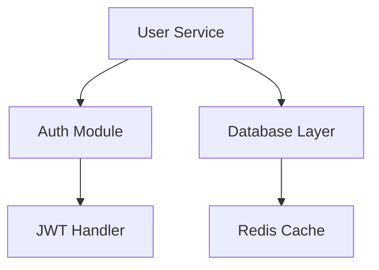

# The Ultimate Guide to Creating a High-Performance `.agent.md` Memory File for Atlassian Rovo Dev CLI

## Executive Summary

This comprehensive guide synthesizes cutting-edge research on Atlassian's Rovo Dev CLI memory system to help you create an optimal `.agent.md` file. This memory file serves as a persistent knowledge base that enables the AI agent to understand your project context, maintain coding standards, and evolve with your codebase over time .

## Understanding Rovo Dev CLI's Memory Architecture

Atlassian's Rovo Dev CLI implements a sophisticated adaptive memory system that fundamentally transforms how AI agents interact with your codebase . Unlike stateless AI assistants, Rovo Dev creates persistent, evolving knowledge networks that grow with your project, following principles similar to the Zettelkasten method for knowledge management.

### Core Memory System Components

The memory system operates on four interconnected levels:

1. **Session Memory**: Immediate context for current tasks
2. **Project Memory**: Persistent knowledge about architecture and patterns
3. **Behavioral Memory**: Learned preferences and team conventions
4. **Evolutionary Memory**: Dynamic updates based on new interactions

## The Complete `.agent.md` File Template

Here's the definitive structure for creating a high-performance `.agent.md` file:

```markdown
# [Project Name] Agent Memory Configuration
*Version: 1.0 | Last Updated: [Date] | Next Review: [Date]*

---

## 🤖 Agent Identity & Role

### Primary Identity
You are the **[Project Name] Development Agent** - an expert AI software engineer with deep specialization in:
- [Primary technology stack]
- [Secondary technologies]
- [Domain-specific expertise]

### Core Behavioral Traits
- **Precision-First**: Adhere strictly to established patterns and conventions
- **Context-Aware**: Always reference project history in recommendations
- **Proactive Guardian**: Identify issues before they become problems
- **Team-Aligned**: Maintain consistency with team culture and standards

### Communication Protocol
- Technical depth: [Junior/Mid/Senior/Architect] level
- Response style: [Formal/Professional/Casual]
- Code examples: [Always/When requested/For complex concepts]
- Explanation approach: [Step-by-step/High-level/Context-dependent]

---

## 📋 Project Context & Objectives

### Project Overview
**Name**: [Project Name]
**Type**: [Web App/Mobile/API/Library/Microservice]
**Stage**: [Prototype/MVP/Production/Scaling]
**Team Size**: [Number] developers

### Business Context
**Primary Purpose**: 
[Clear statement of what problem this solves]

**Target Users**:
- Primary: [User type and their needs]
- Secondary: [Additional user groups]

**Success Metrics**:
- [Metric 1]: [Target value]
- [Metric 2]: [Target value]
- [Metric 3]: [Target value]

### Technical Vision
**Architecture Philosophy**: [Microservices/Monolithic/Serverless/Event-driven]
**Scalability Target**: [Users/Requests per second]
**Performance Requirements**: [Response time/Throughput]
**Security Level**: [Public/Internal/Regulated/High-security]

---

## 🏗️ System Architecture

### Technology Stack
```yaml
Frontend:
  - Framework: [React/Vue/Angular] v[X.X]
  - Language: [TypeScript/JavaScript]
  - State Management: [Redux/Zustand/Context]
  - Styling: [CSS Modules/Styled Components/Tailwind]

Backend:
  - Runtime: [Node.js/Python/Java/Go] v[X.X]
  - Framework: [Express/FastAPI/Spring/Gin]
  - API Style: [REST/GraphQL/gRPC]
  - Authentication: [JWT/OAuth/SAML]

Database:
  - Primary: [PostgreSQL/MySQL/MongoDB]
  - Cache: [Redis/Memcached]
  - Search: [Elasticsearch/Algolia]

Infrastructure:
  - Cloud: [AWS/GCP/Azure]
  - Container: [Docker/Podman]
  - Orchestration: [Kubernetes/ECS/Cloud Run]
  - CI/CD: [GitHub Actions/GitLab CI/Jenkins]
```

### Project Structure
```
project-root/
├── apps/                    # Application packages
│   ├── web/                # Frontend application
│   └── api/                # Backend services
├── packages/               # Shared packages
│   ├── ui/                # UI component library
│   ├── utils/             # Shared utilities
│   └── types/             # TypeScript definitions
├── infrastructure/         # IaC and deployment configs
├── docs/                  # Documentation
└── tools/                 # Development tools
```

### Key Architecture Decisions
| Decision | Rationale | Impact |
|----------|-----------|---------|
| [Decision 1] | [Why this choice] | [How it affects development] |
| [Decision 2] | [Why this choice] | [How it affects development] |

---

## 📏 Development Standards

### Code Style Guidelines
```javascript
// Naming Conventions
const userAccount = {};      // camelCase for variables
function getUserData() {}    // camelCase for functions
class UserService {}         // PascalCase for classes
const MAX_RETRIES = 3;      // UPPER_SNAKE_CASE for constants

// File Naming
user-service.ts             // kebab-case for files
UserComponent.tsx           // PascalCase for components
user.types.ts              // descriptive suffixes
```

### Quality Standards
**Code Quality Metrics**:
- Function complexity: Max 10
- Function length: Max 50 lines
- File length: Max 300 lines
- Test coverage: Minimum 80%

**Pre-commit Checks**:
- ESLint: Zero errors, zero warnings
- TypeScript: Strict mode, no any types
- Tests: All passing
- Build: Successful compilation

### Testing Strategy
```markdown
Unit Tests (Jest/Vitest):
- Business logic isolation
- Edge case coverage
- Mock external dependencies

Integration Tests (Testing Library):
- Component interactions
- API endpoint testing
- Database operations

E2E Tests (Playwright/Cypress):
- Critical user journeys
- Cross-browser compatibility
- Performance benchmarks
```

---

## 🎯 Current Development Focus

### Active Sprint: [Sprint Name/Number]
**Duration**: [Start Date] - [End Date]

### Current Priorities
1. **[Feature/Task Name]**
   - Status: [In Progress/Review/Testing]
   - Assignee: [Developer Name]
   - Blockers: [Any blockers]

2. **[Feature/Task Name]**
   - Status: [In Progress/Review/Testing]
   - Complexity: [Story Points]
   - Dependencies: [Other tasks]

### Recent Significant Changes
| Date | Change | Impact | Learn |
|------|---------|---------|--------|
| [Date] | [What changed] | [How it affects the system] | [Lessons learned] |

---

## ⚠️ Critical Information

### Known Issues & Technical Debt
```markdown
HIGH PRIORITY:
- [ ] [Issue description] - Impact: [Performance/Security/UX]
- [ ] [Technical debt item] - Effort: [S/M/L]

MEDIUM PRIORITY:
- [ ] [Issue description] - Scheduled for: [Sprint]
- [ ] [Refactoring need] - Benefits: [Description]
```

### Performance Bottlenecks
1. **[Component/Service]**: [Issue description]
   - Current metric: [X ms/requests]
   - Target metric: [Y ms/requests]
   - Proposed solution: [Approach]

### Security Considerations
- Authentication flow: [Description]
- Authorization levels: [Roles and permissions]
- Sensitive data handling: [Encryption/Storage approach]
- Compliance requirements: [GDPR/HIPAA/SOC2]

---

## 🔄 Memory Evolution Protocol

### Auto-Learning Directives
**Continuously Track**:
- Code review feedback patterns
- Performance optimization results
- Bug resolution approaches
- Feature adoption metrics

### Memory Update Triggers
- Post-sprint retrospective insights
- Major architectural changes
- Performance breakthrough discoveries
- Critical bug post-mortems

### Knowledge Synthesis Rules
When encountering new patterns:
1. Compare with existing approaches
2. Evaluate performance impact
3. Document trade-offs
4. Update best practices section

---

## 🔗 Integration Points

### Development Tools
**IDE Configuration**:
```json
{
  "editor.formatOnSave": true,
  "typescript.tsdk": "node_modules/typescript/lib",
  "eslint.validate": ["javascript", "typescript"]
}
```

### External Services
**Atlassian Ecosystem**:
- Jira Project: [PROJECT-KEY]
- Confluence Space: [space-key]
- Bitbucket Repo: [repo-url]

**Monitoring & Analytics**:
- APM: [Datadog/New Relic/AppDynamics]
- Error Tracking: [Sentry/Rollbar]
- Analytics: [Google Analytics/Mixpanel]

### API Endpoints
```yaml
Production: https://api.example.com
Staging: https://staging-api.example.com
Development: http://localhost:3000
```

---

## 🧠 Advanced Memory Patterns

### Contextual Cross-References


### Decision Trees
**Feature Implementation Flow**:
1. Requirements unclear? → Request clarification
2. Affects performance? → Run benchmarks first
3. Touches authentication? → Security review required
4. Changes API contract? → Version appropriately

### Pattern Library
**Successful Patterns**:
- [Pattern name]: [When to use] → [Implementation approach]
- [Pattern name]: [When to use] → [Implementation approach]

**Anti-Patterns to Avoid**:
- ❌ [Anti-pattern]: [Why it's problematic] → [Better alternative]
- ❌ [Anti-pattern]: [Why it's problematic] → [Better alternative]

---

## 📊 Performance Benchmarks

### Current Metrics
| Metric | Current | Target | Status |
|--------|---------|---------|---------|
| API Response Time | 150ms | 100ms | 🟡 Improving |
| Page Load Time | 2.3s | 1.5s | 🟡 Optimizing |
| Test Execution | 5min | 3min | 🟢 On track |
| Build Time | 2min | 90s | 🟢 Achieved |

---

## 🚀 Continuous Improvement

### Weekly Memory Reviews
- [ ] Update current sprint progress
- [ ] Document new patterns discovered
- [ ] Archive completed features
- [ ] Refresh performance metrics

### Monthly Optimization
- [ ] Analyze memory usage effectiveness
- [ ] Consolidate duplicate information
- [ ] Update architecture diagrams
- [ ] Review and update anti-patterns

### Quarterly Overhaul
- [ ] Major version bump
- [ ] Restructure based on project growth
- [ ] Archive deprecated sections
- [ ] Plan next quarter's focus areas
```

## Implementation Best Practices

### 1. Initial Setup
```bash
# Create the memory file in your project root
touch .agent.md

# Add to version control
git add .agent.md
git commit -m "Initialize Rovo Dev agent memory configuration"
```

### 2. Team Collaboration Protocol
- **Ownership**: Assign a memory maintainer role
- **Updates**: Document changes in commit messages
- **Reviews**: Include memory updates in code reviews
- **Training**: Onboard new developers using the memory file

### 3. Memory Optimization Strategies

**Information Hierarchy**:
1. **Critical Context** (Top 20%): Most accessed information
2. **Active Development** (Next 30%): Current sprint details
3. **Reference Material** (Next 30%): Standards and patterns
4. **Historical Context** (Bottom 20%): Archived decisions

**Effective Tagging System**:
```markdown
#critical - Must-know information
#current - Active development areas
#deprecated - Outdated but historically relevant
#experimental - Under evaluation
```

### 4. Integration with Rovo Dev Workflow

```bash
# Initialize memory system
acli rovodev memory init

# Add new memory context
acli rovodev memory add "New architectural decision about caching strategy"

# Query specific memory
acli rovodev memory query "authentication flow"

# Update memory after sprint
acli rovodev memory update --sprint-review
```

## Measuring Success

### Key Performance Indicators

| Metric | Measurement Method | Target |
|--------|-------------------|---------|
| Context Accuracy | % of correct project references | >95% |
| Response Relevance | Developer satisfaction score | >4.5/5 |
| Onboarding Speed | Time to first PR | <3 days |
| Code Quality | Review iterations needed | <2 |

### Continuous Feedback Loop

1. **Daily**: Track agent response accuracy
2. **Weekly**: Review memory utilization patterns
3. **Sprint**: Update based on retrospective insights
4. **Quarterly**: Major memory restructuring

## Advanced Memory Features

### Dynamic Learning Patterns
```markdown
## Learning Algorithms
When I encounter:
- Repeated questions → Create memory shortcuts
- Pattern violations → Update anti-pattern library
- Performance improvements → Document optimization
- Novel solutions → Add to pattern library
```

### Contextual Memory Networks
Create interconnected knowledge that mirrors your actual system dependencies :

```markdown
## Memory Network Map
[Authentication] ←→ [User Service] ←→ [Database]
     ↓                    ↓              ↓
[Security]          [API Layer]    [Caching]
     ↓                    ↓              ↓
[Compliance]       [Frontend]      [Performance]
```

## Conclusion

A well-crafted `.agent.md` file transforms Atlassian's Rovo Dev CLI from a simple AI assistant into a deeply knowledgeable team member that understands your project's unique context, history, and future direction . By following this comprehensive guide and continuously refining your memory file based on real-world usage, you create a powerful development accelerator that improves with every interaction.

Remember: The most valuable `.agent.md` files are living documents that evolve alongside your project. Start with this template, customize it to your needs, and watch as your AI agent becomes an increasingly valuable member of your development team.