# Luminari's Quest - Points Ecosystem Audit

**Version 1.0** | **Date**: December 2024 | **Status**: Phase 1 - Complete Inventory

---

# 🎓 COMPREHENSIVE EXPERIENCE POINTS IMPLEMENTATION PLAN

**Implementation Priority**: High | **Complexity**: Medium | **Timeline**: 3-5 days

## 📋 Executive Summary

Experience Points is currently tracked in the audit but not implemented. This plan integrates XP as a **therapeutic progression system** that enhances the existing Guardian Trust mechanics while providing clear advancement feedback to players.

## 🎯 Design Philosophy

**Therapeutic-First Approach:**
- **Growth Mindset**: Reward effort and attempts, not just success
- **Gentle Progression**: Avoid grinding; encourage exploration and reflection
- **Meaningful Advancement**: Each level provides tangible benefits that support the therapeutic journey
- **Integration**: XP enhances rather than competes with Guardian Trust system

## 📊 Current State Analysis

**Existing Status:**
- ✅ Listed in POINTS_AUDIT.md but marked "minimal active modification"
- ❌ Not in GameState interface
- ❌ No modification functions
- ❌ No database persistence
- ✅ UI placeholder exists in StatsBar component

**Integration Points Identified:**
- Scene Engine: Rewards given on scene completion
- Combat System: Victory and action rewards
- Milestone System: Major progression bonuses
- Journal System: Reflection engagement rewards

## 🏗️ Technical Implementation Plan

### Phase 1: Core System Foundation (Day 1)

#### 1.1 GameState Interface Extension
```typescript
// Add to src/store/game-store.ts GameState interface
interface GameState {
  // ... existing fields ...
  experiencePoints: number;        // Current XP total
  experienceToNext: number;        // XP needed for next level
  // playerLevel: number;          // Already exists, currently static
}
```

#### 1.2 XP Calculation Functions
```typescript
// Mathematical progression curve
const getXPRequiredForLevel = (level: number): number => {
  const baseXP = 100;
  const growthFactor = 1.4; // Gentle exponential growth
  return Math.floor(baseXP * Math.pow(growthFactor, level - 1));
};

const calculateLevelProgression = (totalXP: number) => {
  let level = 1;
  let xpForCurrentLevel = 0;
  
  while (totalXP >= xpForCurrentLevel + getXPRequiredForLevel(level)) {
    xpForCurrentLevel += getXPRequiredForLevel(level);
    level++;
  }
  
  return {
    level,
    currentLevelXP: totalXP - xpForCurrentLevel,
    xpToNext: getXPRequiredForLevel(level)
  };
};
```

#### 1.3 Store Actions
```typescript
// Add to game store actions
modifyExperiencePoints: (delta: number, reason?: string) => {
  set((state) => {
    const newTotalXP = Math.max(0, state.experiencePoints + delta);
    const { level, currentLevelXP, xpToNext } = calculateLevelProgression(newTotalXP);
    const leveledUp = level > state.playerLevel;
    
    if (leveledUp && reason) {
      // Trigger level-up celebration and journal prompt
      get().addJournalEntry({
        type: 'learning',
        title: `Level ${level} Achieved!`,
        content: `Your journey of growth continues. Reflect on how far you've come.`,
        trustLevel: state.guardianTrust,
        tags: ['level-up', 'achievement']
      });
    }
    
    return {
      experiencePoints: newTotalXP,
      experienceToNext: xpToNext,
      playerLevel: level,
      saveState: { ...state.saveState, hasUnsavedChanges: true }
    };
  });
},

getPlayerLevel: () => get().playerLevel,
getExperienceProgress: () => ({
  current: get().experiencePoints,
  toNext: get().experienceToNext,
  percentage: (get().experiencePoints / get().experienceToNext) * 100
}),
```

### Phase 2: Reward Integration (Day 2)

#### 2.1 Scene Engine XP Rewards
```typescript
// Modify src/engine/scene-engine.ts handleSceneOutcome
const getSceneXPReward = (sceneType: string, success: boolean, sceneIndex: number): number => {
  const baseXP = {
    social: 25,      // Interpersonal growth
    skill: 35,       // Problem-solving 
    combat: 50,      // Confronting shadows
    journal: 20,     // Self-reflection
    exploration: 30  // Discovery
  };
  
  const successMultiplier = success ? 1.0 : 0.6; // Partial XP for attempts
  const difficultyBonus = Math.floor(sceneIndex / 10) * 5; // Progressive difficulty
  
  return Math.floor((baseXP[sceneType] + difficultyBonus) * successMultiplier);
};

// Add to scene outcome processing
const xpGained = getSceneXPReward(scene.type, outcome.success, sceneIndex);
gameStore.modifyExperiencePoints(xpGained, `${scene.type} scene ${outcome.success ? 'completed' : 'attempted'}`);
```

#### 2.2 Combat XP Integration
```typescript
// Add to NEW combat system (src/features/combat/store/combat-store.ts)
// Victory XP in endCombat function
if (victory) {
  const combatXP = {
    'whisper-of-doubt': 40,
    'shadow-of-isolation': 55,
    'overwhelm-tempest': 70,
    'echo-of-past-pain': 75
  };
  
  const xpReward = combatXP[currentEnemy.id] || 50;
  gameStore.modifyExperiencePoints(xpReward, `${currentEnemy.name} defeated`);
}

// Action XP (small amounts for engagement)
const actionXP = { ILLUMINATE: 3, REFLECT: 2, ENDURE: 2, EMBRACE: 4 };
gameStore.modifyExperiencePoints(actionXP[action] || 2, `combat action: ${action}`);
```

#### 2.3 Milestone XP Bonuses
```typescript
// Enhance milestone system in updateMilestone
const milestoneXPBonuses = {
  25: 150,  // Inner Strength
  50: 200,  // Finding Balance  
  75: 250   // Deep Connection
};

if (milestonesToAchieve.length > 0) {
  milestonesToAchieve.forEach(milestone => {
    const xpBonus = milestoneXPBonuses[milestone.level] || 100;
    get().modifyExperiencePoints(xpBonus, `Milestone: ${milestone.label}`);
  });
}
```

### Phase 3: Level Benefits System (Day 3)

#### 3.1 Level-Based Benefits
```typescript
// Add level benefit system
const getLevelBenefits = (level: number) => {
  const benefits = {
    maxEnergyBonus: Math.floor((level - 1) / 2) * 10,      // +10 energy every 2 levels
    startingLPBonus: Math.floor((level - 1) / 3) * 5,      // +5 LP every 3 levels
    energyCostReduction: Math.floor((level - 1) / 4),      // -1 energy cost every 4 levels
    trustGainMultiplier: 1 + (Math.floor((level - 1) / 5) * 0.2) // +20% trust every 5 levels
  };
  
  return benefits;
};

// Apply benefits in relevant systems
const applyLevelBenefits = () => {
  const level = get().playerLevel;
  const benefits = getLevelBenefits(level);
  
  set((state) => ({
    maxPlayerEnergy: 100 + benefits.maxEnergyBonus,
    lightPoints: Math.max(state.lightPoints, benefits.startingLPBonus)
  }));
};
```

### Phase 4: Database & UI Integration (Day 4)

#### 4.1 Database Migration
```sql
-- Create migration: 20250629000000_add_experience_points.sql
ALTER TABLE public.game_states 
ADD COLUMN IF NOT EXISTS experience_points INTEGER DEFAULT 0 CHECK (experience_points >= 0),
ADD COLUMN IF NOT EXISTS experience_to_next INTEGER DEFAULT 100 CHECK (experience_to_next > 0);

-- Update existing users with default values
UPDATE public.game_states 
SET 
  experience_points = COALESCE(experience_points, 0),
  experience_to_next = COALESCE(experience_to_next, 100)
WHERE 
  experience_points IS NULL 
  OR experience_to_next IS NULL;

-- Add comment documentation
COMMENT ON COLUMN public.game_states.experience_points IS 'Player experience points for character progression';
COMMENT ON COLUMN public.game_states.experience_to_next IS 'Experience points needed to reach next level';
```

#### 4.2 Save/Load Integration
```typescript
// Add to saveToSupabase function
const gameState = {
  // ... existing fields ...
  experience_points: currentState.experiencePoints,
  experience_to_next: currentState.experienceToNext,
};

// Add to loadFromSupabase function
experiencePoints: gameState.experience_points ?? 0,
experienceToNext: gameState.experience_to_next ?? 100,
```

#### 4.3 UI Enhancement
```typescript
// Enhance StatsBar component to show XP progress
const XPBar = () => {
  const { experiencePoints, experienceToNext, playerLevel } = useGameStore();
  const progress = (experiencePoints / experienceToNext) * 100;
  
  return (
    <div className="xp-container">
      <div className="level-badge">Lv.{playerLevel}</div>
      <div className="xp-bar">
        <div className="xp-progress" style={{ width: `${progress}%` }} />
      </div>
      <div className="xp-text">{experiencePoints}/{experienceToNext} XP</div>
    </div>
  );
};
```

### Phase 5: Testing & Polish (Day 5)

#### 5.1 Comprehensive Test Suite
```typescript
// Create src/__tests__/experience-system.test.ts
describe('Experience Point System', () => {
  test('XP calculation and level progression');
  test('Scene completion XP rewards');
  test('Combat victory XP integration');
  test('Milestone XP bonuses');
  test('Level benefit application');
  test('Database persistence');
  test('UI display accuracy');
});
```

#### 5.2 Balance Testing
- Verify progression feels rewarding but not overwhelming
- Test XP rates align with intended session lengths
- Ensure level benefits provide meaningful advancement

## 🎮 Therapeutic Integration Rationale

**Why This Design Supports Therapy:**

1. **Positive Reinforcement**: Consistent XP for engagement rewards participation
2. **Growth Mindset**: Partial XP for failed attempts normalizes setbacks
3. **Progress Visualization**: Clear advancement counters therapy fatigue
4. **Meaningful Levels**: Benefits enhance rather than gate content
5. **Reflection Integration**: Level-ups trigger journal prompts for processing

## 📊 Expected Progression Curve

**Typical Player Journey:**
- **Session 1** (30 min): 2-3 scenes → ~75-150 XP → Level 2
- **Session 2-3** (1 hour): 4-5 scenes + combat → ~200-300 XP → Level 3-4
- **Week 1**: Regular engagement → Level 5-6 with meaningful benefits
- **Month 1**: Consistent therapy participation → Level 8-10

**Level Benefits Timeline:**
- Level 2: +10 max energy (enhanced capacity)
- Level 3: +5 starting Light Points (combat confidence)
- Level 4: -1 energy costs (reduced barrier to action)
- Level 5: +20% trust gains (accelerated therapeutic progress)

## 🔧 Implementation Checklist

### Technical Tasks
- [ ] Add experiencePoints to GameState interface
- [ ] Implement XP calculation functions
- [ ] Create modifyExperiencePoints action
- [ ] Integrate XP rewards in scene engine
- [ ] Add combat XP system
- [ ] Enhance milestone XP bonuses
- [ ] Create level benefits system
- [ ] Database migration for XP fields
- [ ] Update save/load functions
- [ ] Enhance StatsBar UI component
- [ ] Create comprehensive test suite

### Design Validation
- [ ] Verify progression curve feels therapeutic
- [ ] Test XP rewards feel meaningful
- [ ] Ensure level benefits enhance gameplay
- [ ] Validate UI clearly communicates progress
- [ ] Confirm integration with existing systems

### Quality Assurance
- [ ] All tests passing
- [ ] Build compiles without errors
- [ ] Database migration tested
- [ ] UI responsive and accessible
- [ ] No breaking changes to existing features

**Estimated Total Implementation Time**: 3-5 days for complete XP system integration

---

## 🎯 Executive Summary

This comprehensive audit catalogs all point-based systems within Luminari's Quest, a therapeutic AI-powered RPG. The application uses 12 distinct point types across two separate combat systems (NEW and DEPRECATED), with complex interdependencies spanning combat mechanics, scene progression, persistence layers, and therapeutic tracking.

### ⚠️ Critical Findings
- **Two Combat Systems**: NEW system (`/src/features/combat/`) vs DEPRECATED system (`/src/components/combat/`)
- **State Synchronization Issues**: Points must sync between game store and combat store during combat initiation
- **Complex Persistence**: Points stored across multiple database tables and local storage systems
- **Energy Regeneration**: Active background processes managing energy point recovery

---

## 📊 Complete Point Type Inventory

### 1. **Light Points (LP)** ⭐ *Core Combat Resource*
- **Range**: 0 to ∞ (no hard cap, practical max ~20)
- **Initial Value**: 10 (default), synced from game store
- **Purpose**: Positive emotional resources for combat actions
- **Modification Triggers**:
  - Combat actions (cost varies by action)
  - Scene success rewards (+3-8 LP)
  - Shadow defeat bonuses (+5-8 LP)
  - Shadow-to-light conversion (+SP conversion)

### 2. **Shadow Points (SP)** 🌑 *Challenge Growth Resource*
- **Range**: 0 to ∞ (no hard cap, practical max ~15)
- **Initial Value**: 0-5 (variable based on game state)
- **Purpose**: Challenges that can become growth opportunities
- **Modification Triggers**:
  - Scene failures (+2-4 SP)
  - Combat defeat penalties (+3-4 SP)
  - Shadow action effects (various)
  - Conversion to Light Points (-SP conversion)

### 3. **Player Health** ❤️ *Life Force System*
- **Range**: 0-100 (strict bounds)
- **Initial Value**: 100
- **Purpose**: Player survivability and combat endurance
- **Modification Triggers**:
  - Shadow attack damage (-1 to -10)
  - Scene-based health damage (-1 to -5)
  - Post-combat restoration (→100%)
  - Healing actions (+variable)

### 4. **Player Energy** ⚡ *Action Resource System*
- **Range**: 0-maxPlayerEnergy (default 0-100)
- **Initial Value**: 100/100
- **Purpose**: Resource for scene actions and combat abilities
- **Modification Triggers**:
  - Scene attempts (-5 to -15 energy)
  - Combat actions (-1 to -5 energy)
  - Success rewards (+2 to +8 energy)
  - **Automatic regeneration** (+1 every 30 seconds)

### 5. **Experience Points** 🎓 *Progress Tracking*
- **Range**: 0 to ∞
- **Initial Value**: 0
- **Purpose**: Character development and achievement tracking
- **Modification Triggers**: *Currently tracked but minimal active modification*

### 6. **Player Level** 📈 *Character Progression*
- **Range**: 1 to ∞
- **Initial Value**: 1
- **Purpose**: Character advancement and power scaling
- **Modification Triggers**: *Currently static, linked to experience thresholds*

### 7. **Guardian Trust** 🤝 *Core Progression Mechanic*
- **Range**: 0-100 (strict bounds)
- **Initial Value**: 50
- **Purpose**: Central therapeutic progression metric
- **Modification Triggers**:
  - Scene success/failure (±5 to ±15)
  - Combat outcomes (variable)
  - Milestone achievements (automatic)
  - **Triggers milestone unlocks** at 25, 50, 75

### 8. **Milestones** 🏆 *Achievement System*
- **Structure**: Fixed set at levels 25, 50, 75
- **Values**: `{ id, level, label, achieved, achievedAt }`
- **Purpose**: Major progression markers tied to Guardian Trust
- **Modification Triggers**:
  - Guardian Trust threshold crossing
  - Automatic achievement marking
  - Journal entry generation

### 9. **Scene Index** 🎬 *Narrative Progression*
- **Range**: 0-39 (40 total scenes)
- **Initial Value**: 0
- **Purpose**: Story advancement and unlock progression
- **Modification Triggers**:
  - Successful scene completion
  - Combat victory (auto-advance)
  - Manual advancement calls

### 10. **Turn Count** 🔄 *Combat Flow Control*
- **Range**: 0 to 20 (max combat length)
- **Initial Value**: 1 on combat start
- **Purpose**: Combat round tracking and time limits
- **Modification Triggers**:
  - Each combat action
  - Turn end processing
  - Combat reset

### 11. **Victory Rewards** 🎁 *Combat Completion Bonuses*
- **Structure**: `{ lpBonus, growthMessage, permanentBenefit }`
- **Values**: LP bonuses +5 to +8 (progressive by shadow type)
- **Purpose**: Combat success incentives
- **Modification Triggers**:
  - Shadow manifestation defeat
  - Combat victory resolution

### 12. **Resource Meters** 📊 *UI Display Values*
- **Types**: Health bars, LP/SP meters, energy displays
- **Range**: Percentage-based (0-100%)
- **Purpose**: Real-time status visualization
- **Modification Triggers**: Reactive to underlying point changes

---

## 🏗️ System Architecture Analysis

### Primary State Stores

#### Game Store (`/src/store/game-store.ts`)
- **Size**: 1,643 lines
- **Points Managed**: Health, Energy, LP, SP, Trust, Level, Scene Index, Milestones
- **Persistence**: Supabase integration with automatic save/load
- **Energy Regeneration**: Background interval (`_energyRegenInterval`)

#### Combat Store (NEW) (`/src/features/combat/store/combat-store.ts`)
- **Size**: 516 lines  
- **Points Managed**: LP, SP, Health, Level, Turn Count, Combat Log
- **Integration**: Syncs from Game Store on combat start
- **Status**: ✅ **ACTIVE** - All new development

#### Combat Store (OLD) (`/src/store/game-store.ts` - combat slice)
- **Status**: ❌ **DEPRECATED** - Backwards compatibility only
- **Activation**: URL parameter `?legacyCombat=1`

### Database Schema

#### `game_states` Table
```sql
guardian_trust INTEGER NOT NULL DEFAULT 50 CHECK (guardian_trust >= 0 AND guardian_trust <= 100)
player_level INTEGER NOT NULL DEFAULT 1 CHECK (player_level >= 1)
current_scene_index INTEGER NOT NULL DEFAULT 0 CHECK (current_scene_index >= 0)
player_energy INTEGER DEFAULT 100 CHECK (player_energy >= 0)
max_player_energy INTEGER DEFAULT 100 CHECK (max_player_energy > 0)
milestones JSONB NOT NULL DEFAULT '[]'::jsonb
scene_history JSONB NOT NULL DEFAULT '[]'::jsonb
```

#### `journal_entries` Table
```sql
trust_level INTEGER NOT NULL CHECK (trust_level >= 0 AND trust_level <= 100)
type TEXT NOT NULL CHECK (type IN ('milestone', 'learning'))
scene_id TEXT (nullable)
```

---

## 🔄 Point Lifecycle Analysis

### Initialization Patterns

#### Game Store Initialization
```typescript
const initialState = {
  guardianTrust: 50,
  playerLevel: 1,
  playerHealth: 100,
  maxPlayerHealth: 100,
  playerEnergy: 100,
  maxPlayerEnergy: 100,
  lightPoints: 0,
  shadowPoints: 0,
  currentSceneIndex: 0,
  milestones: [
    { id: 'milestone-25', level: 25, label: 'Inner Strength', achieved: false },
    { id: 'milestone-50', level: 50, label: 'Finding Balance', achieved: false },
    { id: 'milestone-75', level: 75, label: 'Deep Connection', achieved: false }
  ]
}
```

#### Combat Store Initialization
```typescript
const initialState = {
  resources: { lp: 10, sp: 0 },
  playerHealth: 100,
  playerLevel: 1,
  playerEnergy: 100,
  maxPlayerEnergy: 100,
  turn: 0,
  statusEffects: { /* complex status tracking */ }
}
```

### Modification Flows

#### Scene Success Flow
1. **Scene attempted** → Energy cost applied (-5 to -15)
2. **Dice roll processed** → Success/failure determined  
3. **Rewards calculated** → LP/SP/Energy rewards applied
4. **Trust updated** → Guardian Trust modified (±5 to ±15)
5. **Milestones checked** → Automatic achievement processing
6. **State persisted** → Database save triggered

#### Combat Flow
1. **Combat triggered** → Store synchronization (Game → Combat)
2. **Action executed** → LP/SP/Energy costs applied
3. **Turn processed** → Turn counter incremented
4. **Victory achieved** → Rewards applied, health restored
5. **State synchronized** → Combat → Game store sync
6. **Scene advanced** → Automatic progression

### Cross-System Dependencies

#### Combat ↔ Game Store Synchronization
```typescript
// Combat start - Game store → Combat store
startCombat: (enemy, gameResources) => {
  const resources = gameResources ? {
    lp: gameResources.lightPoints,
    sp: gameResources.shadowPoints
  } : initialState.resources;
}

// Combat end - Combat store → Game store  
endCombat: (victory: boolean) => {
  // Apply LP/SP changes back to game store
  // Restore health to 100%
  // Advance scene on victory
}
```

#### Milestone → Journal Integration
```typescript
updateMilestone: (trustLevel: number) => {
  // Check which milestones need achievement
  const milestonesToAchieve = state.milestones.filter(
    (milestone) => trustLevel >= milestone.level && !milestone.achieved
  );
  
  // Add to pending journal entries
  // Update milestone achievement status
}
```

---

## 🔍 Integration Points Mapping

### Scene Engine Integration
- **File**: `src/engine/scene-engine.ts` (913 lines)
- **Point Interactions**:
  - LP rewards for scene success (+3-8)
  - SP penalties for scene failure (+2-4)
  - Energy costs for scene attempts (-5-15)
  - Energy rewards for success (+2-8)
  - Trust modifications based on outcomes

### Combat Engine Integration  
- **File**: `src/engine/combat-engine.ts`
- **Point Interactions**:
  - LP/SP costs for combat actions
  - Health damage calculations
  - Victory reward processing
  - Status effect applications

### UI Component Integration
- **StatsBar**: Displays Health, Energy, Experience
- **ResourcePanel**: Shows LP, SP, Level, Turn count
- **Progress Page**: Guardian Trust visualization
- **Combat Overlays**: Real-time point tracking

### Persistence Integration
- **Supabase Operations**: Save/load all persistent points
- **Local Storage**: Zustand persistence for hydration
- **Background Processes**: Energy regeneration intervals

---

## ⚠️ Identified Issues & Risks

### 1. **State Synchronization Complexity**
- **Issue**: Two combat systems create sync confusion
- **Risk**: Point values may desync between stores
- **Evidence**: Multiple sync points in combat start/end

### 2. **Energy Regeneration Background Process**
- **Issue**: Active intervals may leak or conflict
- **Risk**: Memory leaks, duplicate intervals
- **Evidence**: `_energyRegenInterval` management in game store

### 3. **Milestone Journal Dependencies**
- **Issue**: Complex milestone → journal entry pipeline
- **Risk**: Duplicate entries, sync issues
- **Evidence**: `pendingMilestoneJournals` Set management

### 4. **Database Constraint Mismatches**
- **Issue**: Code allows values outside DB constraints
- **Risk**: Save failures, data corruption
- **Evidence**: DB CHECK constraints vs code validation

### 5. **Legacy Combat System Persistence**
- **Issue**: OLD combat system still accessible
- **Risk**: User confusion, development overhead
- **Evidence**: `?legacyCombat=1` parameter still active

---

## 📈 Performance Considerations

### Resource-Intensive Operations
1. **Energy Regeneration**: 30-second intervals across all users
2. **Combat Log Management**: Growing arrays during combat
3. **State Persistence**: Full game state saves on changes
4. **Milestone Processing**: Complex achievement calculations

### Optimization Opportunities
1. **Debounced Save Operations**: Reduce database calls
2. **Selective State Updates**: Avoid full state replacement
3. **Combat Log Pruning**: Limit log entry retention
4. **Energy Regen Optimization**: Smart interval management

---

## 🗺️ Point Flow Diagram

```mermaid
graph TD
    A[Scene Attempt] --> B{Success?}
    B -->|Yes| C[LP Reward +3-8]
    B -->|No| D[SP Penalty +2-4]
    
    C --> E[Energy Reward +2-8]
    D --> F[Energy Cost Applied]
    
    E --> G[Trust Update ±5-15]
    F --> G
    G --> H{Trust Threshold?}
    
    H -->|Yes| I[Milestone Achievement]
    H -->|No| J[Continue]
    
    I --> K[Journal Entry Created]
    K --> L[Persist to Database]
    J --> L
    
    M[Combat Trigger] --> N[Sync Game→Combat Store]
    N --> O[Combat Actions: LP/SP Costs]
    O --> P{Victory?}
    
    P -->|Yes| Q[Victory Rewards +5-8 LP]
    P -->|No| R[SP Penalty +3-4]
    
    Q --> S[Health Restore 100%]
    R --> S
    S --> T[Sync Combat→Game Store]
    T --> U[Scene Advancement]
    U --> L
```



---

## 📋 Next Phase Actions

### Phase 2: Integration Analysis (Recommended)
1. **API Endpoint Mapping**: Catalog all database operations
2. **Hook Dependencies**: Trace useEffect and custom hook interactions  
3. **Event Listener Audit**: Map all point-related event handlers
4. **State Management Patterns**: Analyze Zustand usage patterns

### Phase 3: Issue Resolution (Critical)
1. **Combat System Migration**: Remove deprecated OLD system
2. **State Sync Validation**: Implement sync verification
3. **Background Process Audit**: Review all intervals and timers
4. **Database Constraint Alignment**: Match code validation to DB

### Phase 4: Optimization (Performance)
1. **Point Calculation Caching**: Reduce redundant calculations
2. **Persistence Strategy Review**: Optimize save operations
3. **Memory Leak Prevention**: Audit cleanup patterns
4. **Performance Monitoring**: Add point system metrics

---

## 🔖 Development Guidelines

### Working with Points Systems
1. **Always use NEW combat system** (`/src/features/combat/`)
2. **Verify state synchronization** between stores during combat
3. **Test energy regeneration** startup/cleanup
4. **Validate milestone triggers** on trust changes
5. **Check database constraints** before value modifications

### Testing Requirements  
1. **Energy persistence** across sessions
2. **Combat store synchronization** accuracy
3. **Milestone achievement** boundary conditions
4. **Database save/load** integrity
5. **Background process** lifecycle management

---

## 📋 Phase 2: Integration Analysis - Complete ✅

### 1. API Endpoint Mapping

#### Primary Supabase Operations
- **Location**: `src/store/game-store.ts` (Lines 983-1274)
- **Save Operation**: `saveToSupabase()` - Upserts to `game_states` and `journal_entries` tables
- **Load Operation**: `loadFromSupabase()` - Fetches user data with error handling
- **Timeout Management**: 30-second timeouts for all database operations

#### Database Table Operations
```typescript
// Game States Table (Point Persistence)
supabase.from('game_states').upsert({
  guardian_trust: state.guardianTrust,        // 0-100 constraint
  player_level: state.playerLevel,            // >= 1 constraint  
  current_scene_index: state.currentSceneIndex, // >= 0 constraint
  player_energy: state.playerEnergy,          // >= 0 constraint
  max_player_energy: state.maxPlayerEnergy,   // > 0 constraint
  milestones: JSON.stringify(state.milestones),
  scene_history: JSON.stringify(state.sceneHistory)
}, { onConflict: 'user_id' })

// Journal Entries Table (Milestone Integration)
supabase.from('journal_entries').upsert(journalEntries, { onConflict: 'id' })
```

#### Database Constraints (Energy Fields Migration)
```sql
-- Energy system constraints from 20250624000000_add_energy_fields.sql
ALTER TABLE public.game_states 
ADD COLUMN player_energy INTEGER DEFAULT 100 CHECK (player_energy >= 0),
ADD COLUMN max_player_energy INTEGER DEFAULT 100 CHECK (max_player_energy > 0);

-- Cross-field validation
ADD CONSTRAINT check_energy_bounds CHECK (player_energy <= max_player_energy);
```

#### Database Functions & Diagnostics
- **Location**: `supabase/migrations/20250623090533_gentle_silence.sql`
- **Functions**: `diagnose_database_connection()`, `diagnose_journal_save()`, `diagnose_auth_status()`
- **Security**: All functions are `SECURITY DEFINER` with `authenticated` role grants
- **RLS Policies**: Comprehensive row-level security for game_states and journal_entries

### 2. Hook Dependencies Analysis

#### Energy Regeneration Hook (`use-energy-regeneration.ts`)
```typescript
useEffect(() => {
  if (!isAuthenticated || !hasHydrated) return;
  
  startEnergyRegeneration();
  return () => stopEnergyRegeneration();
}, [isAuthenticated, hasHydrated, startEnergyRegeneration, stopEnergyRegeneration]);

// Background regeneration monitoring
useEffect(() => {
  const interval = setInterval(() => {
    if (!document.hidden && document.hasFocus()) {
      regenerateEnergy(); // +1 energy every 30 seconds
    }
  }, 30000);
  
  return () => clearInterval(interval);
}, []);
```

#### Combat Integration Hooks
- **`useCombat.ts`**: 220 lines of combat logic integration
  - `useCallback` for action validation, cost calculation, damage computation
  - `useMemo` for status effects, combat end status, turn management
  - Direct integration with game store point modifications

- **`useCombatSounds.ts`**: Audio feedback for point-based actions
  - Action sound mapping: `ILLUMINATE → illuminate`, `REFLECT → reflect`, `ENDURE → endure`, `EMBRACE → embrace`
  - Volume scaling based on action success/failure
  - Non-blocking audio loading with fallback handling

#### Database Health Monitoring (`use-database-health.ts`)
```typescript
useEffect(() => {
  if (config.enableHealthChecks) {
    startMonitoring();
    return () => stopMonitoring();
  }
}, []);

// Periodic health checks with point system validation
const checkHealth = useCallback(async () => {
  // Tests game_states table accessibility
  // Validates journal_entries table permissions
  // Monitors authentication token validity
}, []);
```

### 3. Event Listener Audit

#### Combat Keyboard Events (`useCombatKeyboard.ts`)
```typescript
useEffect(() => {
  if (!isActive) return;
  
  const handleKeyPress = (event: KeyboardEvent) => {
    // Ignore if typing in input/textarea elements
    if (['INPUT', 'TEXTAREA'].includes(document.activeElement?.tagName || '')) return;
    
    switch (event.key) {
      case '1': executeAction('ILLUMINATE'); break;  // LP cost: 2
      case '2': executeAction('REFLECT'); break;     // SP cost: 2  
      case '3': executeAction('ENDURE'); break;      // No cost
      case '4': executeAction('EMBRACE'); break;     // SP cost: variable
    }
  };
  
  document.addEventListener('keydown', handleKeyPress);
  return () => document.removeEventListener('keydown', handleKeyPress);
}, [isActive, executeAction]);
```

#### Audio System Event Handlers (`sound-manager.ts`)
```typescript
// Non-blocking audio loading with error handling
audio.addEventListener('error', () => {
  logger.warn(`Failed to load audio: ${soundKey}`);
  // Points system continues functioning without audio
});

// Timeout-based fallback (5 seconds)
setTimeout(() => {
  if (!audio.readyState) {
    logger.warn(`Audio loading timeout: ${soundKey}`);
  }
}, 5000);
```

#### Document Visibility API Integration
```typescript
// Game Store - Energy regeneration pausing
if (document.hidden || !document.hasFocus()) {
  logger.debug('Skipping energy regeneration - app not active');
  return;
}

// Health monitoring pausing during inactivity
if (document.hidden || !document.hasFocus()) {
  logger.debug('Skipping health check - app not active');
  return;
}
```

### 4. State Management Pattern Deep Dive

#### Zustand Store Architecture
- **Game Store Size**: 1,643 lines with complex point management
- **Combat Store Size**: 516 lines with combat-specific point tracking
- **Persistence Strategy**: Selective serialization with date/timestamp conversion

#### Point Modification Patterns
```typescript
// Standard modification pattern with bounds checking
modifyLightPoints: (delta: number) => {
  set((state) => ({
    lightPoints: Math.max(0, state.lightPoints + delta),
    saveState: { ...state.saveState, hasUnsavedChanges: true }
  }));
},

// Energy modification with max cap enforcement
modifyPlayerEnergy: (delta: number) => {
  set((state) => ({
    playerEnergy: Math.max(0, Math.min(state.maxPlayerEnergy, state.playerEnergy + delta)),
    saveState: { ...state.saveState, hasUnsavedChanges: true }
  }));
},

// Trust modification with milestone checking
setGuardianTrust: (trust: number) => {
  const clampedTrust = Math.max(0, Math.min(100, trust));
  set((state) => ({ 
    guardianTrust: clampedTrust,
    saveState: { ...state.saveState, hasUnsavedChanges: true }
  }));
  get().updateMilestone(clampedTrust); // Trigger cascade
},
```

#### State Synchronization Patterns
```typescript
// Combat Store ← Game Store (Combat Start)
startCombat: (enemy, gameResources) => {
  const resources = gameResources ? {
    lp: gameResources.lightPoints,
    sp: gameResources.shadowPoints
  } : initialState.resources;
  
  set({
    isActive: true,
    currentEnemy: enemy,
    resources,
    playerHealth: gameResources?.playerHealth || 100,
    playerLevel: gameResources?.playerLevel || 1
  });
},

// Game Store ← Combat Store (Combat End) 
endCombat: (victory: boolean) => {
  const { resources } = get();
  gameStore.getState().modifyLightPoints(resources.lp - currentLP);
  gameStore.getState().modifyShadowPoints(resources.sp - currentSP);
  gameStore.getState().setPlayerHealth(100); // Full heal
}
```

### 5. Code Pattern Analysis

#### Point Modification Function Distribution
- **`modifyLightPoints`**: 15 direct calls across 8 files
- **`modifyShadowPoints`**: 12 direct calls across 6 files  
- **`modifyPlayerEnergy`**: 8 direct calls across 4 files
- **`setGuardianTrust`**: 6 direct calls across 5 files

#### Error Handling Patterns
```typescript
// Comprehensive error classification system
const classifyError = (error: any): SaveErrorType => {
  if (error?.message?.includes('auth')) return SaveErrorType.AUTHENTICATION_ERROR;
  if (error?.message?.includes('permission')) return SaveErrorType.PERMISSION_ERROR;
  if (error?.code === 'PGRST116') return SaveErrorType.VALIDATION_ERROR;
  if (!navigator.onLine) return SaveErrorType.NETWORK_ERROR;
  return SaveErrorType.UNKNOWN_ERROR;
};

// Retry logic with exponential backoff
const isRetryableError = (errorType: SaveErrorType): boolean => {
  return [SaveErrorType.NETWORK_ERROR, SaveErrorType.UNKNOWN_ERROR].includes(errorType);
};
```

#### Validation Boundary Checking
```typescript
// Guardian Trust: Strict 0-100 bounds with milestone triggers
const clampedTrust = Math.max(0, Math.min(100, trust));

// Energy: Clamped to max capacity with regeneration limits  
playerEnergy: Math.max(0, Math.min(state.maxPlayerEnergy, state.playerEnergy + delta))

// Light/Shadow Points: No upper bounds, minimum 0
lightPoints: Math.max(0, state.lightPoints + delta)
```

### 6. Timer-Based Operations Analysis

#### Energy Regeneration System
```typescript
// Primary regeneration interval (30-second cycles)
_energyRegenInterval: setInterval(() => {
  if (!document.hidden && document.hasFocus()) {
    regenerateEnergy(); // +1 energy if < max
  }
}, config.energyRegenInterval); // Default: 30000ms

// Race condition prevention
if (state._isEnergyRegenActive || state._energyRegenInterval) {
  logger.debug('Energy regeneration already running');
  return;
}
```

#### Combat Animation Timers
```typescript
// Combat end modal delay (user experience)
const timer = setTimeout(() => setCanClose(true), 1000);

// Damage indicator animations (visual feedback)
const timer1 = setTimeout(() => setAnimationPhase('float'), 100);
const timer2 = setTimeout(() => setAnimationPhase('fade'), 800); 
const timer3 = setTimeout(() => onComplete?.(), 1000);

// Therapeutic insight display timing
const enterTimer = setTimeout(() => setAnimationPhase('visible'), 200);
const exitTimer = setTimeout(() => setAnimationPhase('exit'), duration - 400);
```

#### Database Operation Timeouts
```typescript
// Save operation timeout (30 seconds)
const savePromise = supabase.from('game_states').upsert(gameState);
const timeoutPromise = new Promise((_, reject) => 
  setTimeout(() => reject(new Error('Save timeout')), 30000)
);
await Promise.race([savePromise, timeoutPromise]);
```

---

## 🚨 Critical Integration Issues Identified

### 1. **Energy Regeneration Race Conditions**
- **Issue**: Multiple intervals can be created simultaneously
- **Evidence**: `_isEnergyRegenActive` flag vs `_energyRegenInterval` existence
- **Risk**: Memory leaks, double-regeneration, performance degradation

### 2. **Combat Store Synchronization Gaps**
- **Issue**: LP/SP values may desync during combat transitions
- **Evidence**: Manual sync calls in `startCombat()` and `endCombat()`
- **Risk**: Point values lost/duplicated during combat

### 3. **Database Constraint Violations**
- **Issue**: Code allows values that violate database CHECK constraints
- **Evidence**: Energy can exceed max_player_energy in memory before DB save
- **Risk**: Save operation failures, data corruption

### 4. **Milestone → Journal Integration Complexity**
- **Issue**: Complex dependency chain for milestone achievements
- **Evidence**: `pendingMilestoneJournals` Set management across multiple triggers
- **Risk**: Duplicate journal entries, missed milestones

### 5. **Timer Cleanup Inconsistencies**
- **Issue**: Inconsistent cleanup patterns across components
- **Evidence**: Some components use useEffect cleanup, others don't
- **Risk**: Memory leaks, zombie timers affecting point calculations

---

## 📈 Performance Impact Analysis

### High-Impact Operations
1. **Energy Regeneration**: Continuous 30-second intervals across all users
2. **Database Health Checks**: Periodic full table accessibility tests
3. **Combat Log Growth**: Unbounded array growth during combat
4. **State Persistence**: Full game state serialization on every point change

### Optimization Opportunities
1. **Debounced Point Saves**: Batch multiple point changes before DB save
2. **Selective State Updates**: Update only changed point values
3. **Smart Regeneration**: Pause regeneration when at max energy
4. **Combat Log Pruning**: Limit log entries to last 50 actions

---

## 🗺️ Integration Flow Diagram


---

### Priority 1: Critical Fixes (Immediate Action Required)
### Priority 2: Performance Optimizations
1. **Implement Debounced Point Saves**
   - Batch point modifications within 5-second windows
   - Reduce database calls by 60-80%
   - Maintain data integrity with conflict resolution

2. **Smart Energy Regeneration**
   - Pause timers when at max energy
   - Resume monitoring only when energy < max
   - Reduce unnecessary interval executions

3. **Combat Log Management**
   - Implement circular buffer (max 50 entries)
   - Add log compression for completed combats
   - Export functionality for full logs


### Priority 3: Architecture Improvements
1. **Centralized Point Validation**
   - Create unified validation middleware
   - Enforce bounds checking across all systems
   - Add comprehensive logging for violations

2. **Enhanced Error Recovery**
   - Implement automatic state recovery
   - Add offline mode with sync queuing
   - Improved user feedback for save failures

3. **Performance Monitoring**
   - Add metrics for point modification frequency
   - Monitor timer/interval health
   - Track database operation latency

---

EoF
